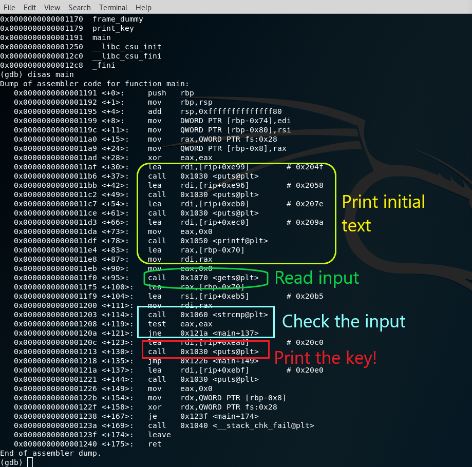

# Richi-challenge CTF writeup

> This is *my* personal solution, the challenge could be solved in many other ways.

Per prima cosa dopo aver dato un'occhiata al sito web bisogna scaricare l'immagine: 
`curl -O https://dave997.github.io/rs3.jpg`.

Tramite il tool **binwalk** è possibile cercare eventuali bytes estranei presenti all'interno dell'immagine.

```bash
binwalk rs3.jpg

922716        0xE145C         Zip archive data, encrypted at least v2.0 to extract, compressed size: 231, uncompressed size: 288, name: lets_go_deeper
923139        0xE1603         End of Zip archive
```
Vediamo che ha trovato un file zip chiamato `lets_go_deeper` nascosto all'interno dell'immagine. <br>
Per estrarlo usiamo il tool **foremost**, dando come query di ricerca *zip files*.

```bash
foremost -t zip -i rs3.jpg 

Processing: rs3.jpg
|foundat=lets_go_deeperUT	
*|
```
Analizzando il file con il comando `file lets_go_deeper`, possiamo vedere che ci sono diverse compressioni, in successione. Con questo script è possibile scompattare il file rimuovendo tutti gli strati di compressione:

```bash
#! /bin/sh

# 4. XZ compression
mv lets_go_deeper lets_go_deeper.xz
xz -d lets_go_deeper.xz

# 3. BUNZIP2 compression
mv lets_go_deeper lets_go_deeper.bz2
bzip2 -d lets_go_deeper.bz2

# 2. GUNZIP compression
mv lets_go_deeper lets_go_deeper.tar.gz
tar -xzvf lets_go_deeper.tar.gz

# 1. ZIP compression
file="lets_go_deeper.zip"
name="lets_go_deeper"
i="1"
while [ $? -eq 0 ]; do 
	echo "$1"
	i=$[$i+1]

	mv $name $file
	unzip $file
done
```

A questo punto vediamo che lo script si blocca perchè il file è protetto da una password, quindi si può provare un bruteforce utilizzando un noto dizionario `rockyou.txt`:

```bash
# extract if needed
gunzip /usr/share/wordlists/rockyou.txt.gz

# crack password
fcrackzip -u -D -p /usr/share/wordlists/rockyou.txt lets_go_deeper.zip 


PASSWORD FOUND!!!!: pw == karii

# unzip it
unzip lets_go_deeper.zip 

Archive:  lets_go_deeper.zip
[lets_go_deeper.zip] key password: 
  inflating: key
```

Il file estratto si chiama **key**, ed è un file binario. Provando ad eseguiro vediamo che per ottenere la password bisogna conoscere la parola magica, quindi per scoprirla andiamo ad eseguire il reverse egineering del binario:

```bash
$> gdb key
(gdb) 
# set a better readable format for perations
(gdb) set disassembly-flavor intel
# this command return a list of all the functions present inside the binary, there is also a function called "print_key", but its a rickroll that I've voluntarily created 
(gdb) info functions 
# so let's disassemble the main to understand how it works:
(gdb) disas main
``` 



A questo punto per poter bypassare il controllo sulla parola magica ho creato un breakpoint esattamente sul comando che setta il flag risultante dalla comparazione, che verrà poi letto dal comando *jump* che andrà ad eseguire il pezzo di codice corretto.<br>
Quindi ho impostato manualmente il flag a 0, il quale significa che l'input e la parola magica corrispondono. 

N.B. Un'altra possibile soluzione poteva essere impostare l'instruction pointer direttamente sull'indirizzo del print della chiave

```bash
# 0x0000555555555208 <+119>: test   eax,eax
(gdb) break *0x0000555555555208
# input inserted!
(gdb) run
(gdb) set $eax=0
(gdb) s
Single stepping until exit from function main,
which has no line number information.
Well done!
 The code is: 190316
(gdb) 
```
Well Done! Il codice è `190316`

Complimenti Dottore!